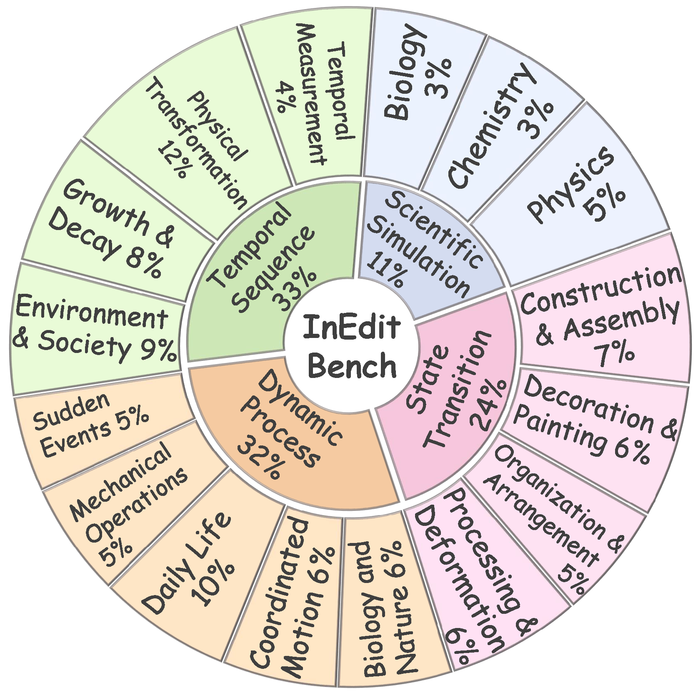
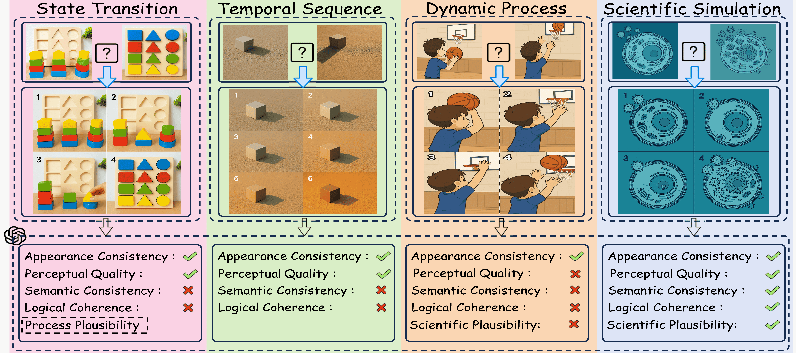

<!-- # InEdit-Bench -->

<h1 align="center"> InEdit-Bench: Benchmarking Intermediate Logical Pathways for
Intelligent Image Editing Models </h1>

<p align="center">
  <a href='https://arxiv.org/abs/2603.03657'>
  </a> 
  <a href='https://huggingface.co/datasets/SZStrong/InEdit-Bench'>
  </a>
</p>

**InEdit-Bench is a benchmark requiring dynamic knowledge reasoning and multi-step planning. It aims to assess a model's ability to perform complex, non-direct image editing through deep semantic understanding.**

<div align="center">
  
</div>

## 🎉 News
- **\[2026/3/4\]** The InEdit-Bench is released at [InEdit-Bench](https://huggingface.co/datasets/SZStrong/InEdit-Bench)!
- **\[2026/3/3\]** The source code is publicly available here!
- **\[2026/2/21\]** Congratulations!

## 📖 Introduction

<div align="center">
  
</div>

We introduce InEdit-Bench, the first benchmark for multi-step image editing and dynamic reasoning. It provides a challenging testbed to assess the ability of a model to comprehend and generate intermediate logical pathways. It spans 4 key domains: state transition, dynamic process, temporal sequence, and scientific simulation. The evaluation is conducted through 6 dimensions: appearance consistency, perceptual quality, semantic consistency, logical coherence, scientific plausibility, and process plausibility.

Our evaluation employs the LMM-as-a-Judge methodology, utilizing GPT-4o as the evaluator to enable automated assessment. During the evaluation process, the evaluator receives the user instructions, scoring rubric, and the generated output, based on which it provides a numerical score for each dimension.

Our comprehensive evaluation of representative image editing models on InEdit-Bench reveals widespread shortcomings in this domain. Specifically, current models still struggle with multi-step editing and dynamic reasoning. By exposing these critical limitations, we hope InEdit-Bench provides a clear direction for future optimization and steers the development of more dynamic, reason-aware, and intelligent multimodal generative models.

<div align="center">
  
</div>

## 🛠️ Quick Start

### 1. Image Download
Download the images from [InEdit-Bench](https://huggingface.co/datasets/SZStrong/InEdit-Bench), concatenate the initial and final images into a single image, and save in `data/`.

For example:
`data/dynamic_process/dynamic_process_1.png`

### 2. Output Generation
After preparing the `image` data, the corresponding `instructions` are located in `data/data.json`. You can use these inputs to generate the corresponding output image.

**Saving Output Files:**
Generated outputs should be saved in the following directory:

**`outputs/{MODEL_NAME}/images/{CATEGORY}/{INDEX_NAME}.{FORMAT}`**

For example:
`outputs/gpt-image-1/images/dynamic_process/dynamic_process_1.png`

### 3. Launch Evaluation
Once all outputs are generated and saved in the specified format, you can evaluate them using the `evalution.py` script.

#### Step 1: Configure API Settings
Open the `evalution.py` file and update the following parameters with your OpenAI credentials:
- `api_key`: Your OpenAI API key.
- `api_base`: Your OpenAI API base URL (if applicable).

#### Step 2: Run the Evaluation Script
Execute the script using the following command:
```bash
python evalution.py 
```

#### Step 3: Results are saved to:
```bash
outputs/{MODEL_NAME}/
```
## ⭐ Citation 
If you find this repository helpful, please consider giving it a star ⭐ and citing:
```bibtex
@misc{sheng2026ineditbenchbenchmarkingintermediatelogical,
      title={InEdit-Bench: Benchmarking Intermediate Logical Pathways for Intelligent Image Editing Models}, 
      author={Zhiqiang Sheng and Xumeng Han and Zhiwei Zhang and Zenghui Xiong and Yifan Ding and Aoxiang Ping and Xiang Li and Tong Guo and Yao Mao},
      year={2026},
      eprint={2603.03657},
      archivePrefix={arXiv},
      primaryClass={cs.CV},
      url={https://arxiv.org/abs/2603.03657}, 
}
```
